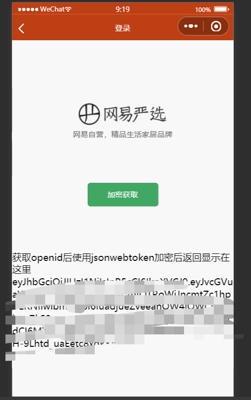

### 介绍

* 使用uni-app开发

* 数据为本地JSON数据,所以不用担心后台问题啦,但是需要手动运行后台

* 下载地址

  * github:https://github.com/superBiuBiuMan/uni-app-wangyi
  * gitee: https://gitee.com/superBiuBiu/uni-app-wangyi

* 运行项目

  * 先运行`npm install`后再hbuilderX中工具条选择`运行 - 运行到小程序模拟器-微信开发者工具`
  * 不过运行之前微信开发者工具**开启下服务端口**

  

* 运行后台

  * 切换到目录`/guiguShopServer`后运行`npm install `
  * 然后`node server.js`

* 后台服务器运行的默认地址

  * `http://localhost:3001`

* 更改自己的后台地址

  * `/utils/config.js`打开更改host字段即可

### 项目截图

#### 首页

#### 购物车

#### 分类

#### 个人中心

#### 登录

#### 商品详情

